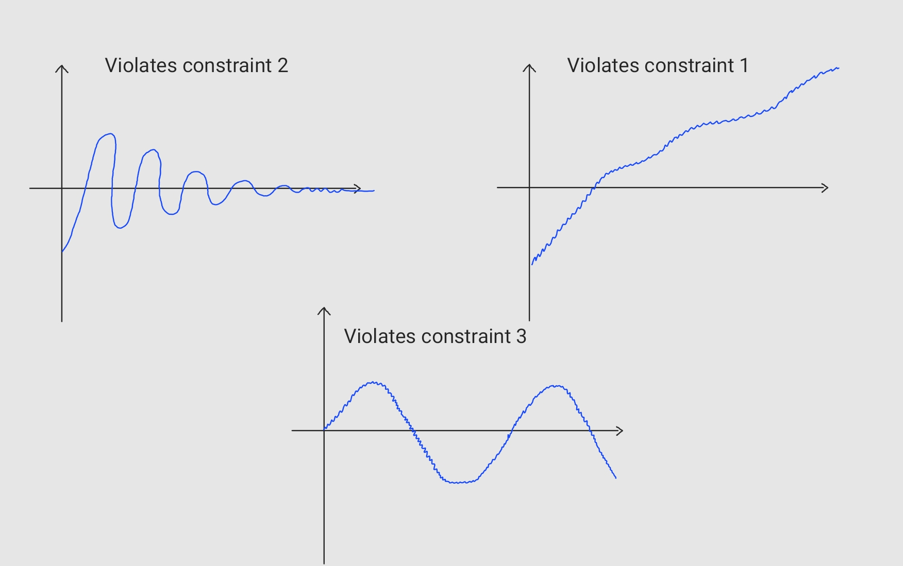
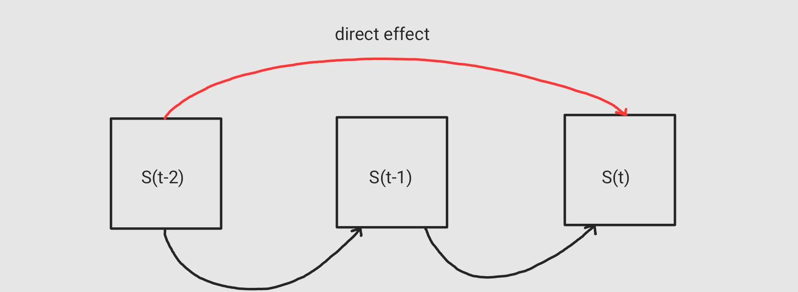

<h1 align="center"> AutoRegression </h1>

Autoregression is a **time series model** that uses observations from previous time steps 
as input to a regression equation to predict the value at the next time step. It is a very 
simple idea that can result in accurate forecasts on a range of time series problems.

$$y_t = c + \phi_1 y_{t-1} + \phi_2 y_{t-2} + ... + \phi_p y_{t-p} + \epsilon $$

$\epsilon$ is the error term of the equation

A **constraint** to using auto regression is that the time series data needs to be stationary.

## Stationarity (weak)
Stationarity means that:
1. $\mu$ is constant
2. $\sigma$ is constant
3. There is no seasonality

### Checking For Stationarity
1. Visually
2. Global vs Local Tests
3. Augmented Dickey Fuller (ADF) 

A very common idea to transform a non-stationary data to a stationary one is differnecing. If $y_t$ is not stationary $y_t - t_{t-1}$ may be stationary.

## Auto Correlation Function (ACF)
Let's explain this by an example:
$S_t$ Average price of Salmon this month
The most intuitive determiner of the price of Salmon this month is the price of Salmon last month and then the month before that and on and on.

The direct effect may be a big food festival for example which happens every two months and affacts the price of Salmon
ACF($s_{t-2}$, $s_t$) = CORR($s_{t-2}$, $s_t$) = Pearson correlation 
| x | y |
| -------- | -------- |
| January | March |
| February | April |
| March | May |
ACF contains the effect of both direct route ($S_{t-2}$ -> $S_{t}$) and indirect route ($S_{t-2}$ -> $S_{t-1}$ -> $S_{t}$)

## Partial Auto Correlation Function (PACF)
In PACF we only care about the direct effect $S_{t-2}$ -> $S_{t}$. The ACF($s_{t-2}$, $s_t$) might be high only becase of the inderect effect, the direct effect may have little to no correlation and will barely help us with predicting the Salmon price. PACF gives us only the direct effect.
$$PACF(k=2): S_t = \phi_{21} s_{t-1} + \phi_{22} s_{t-2} + \epsilon_t$$
$\phi_{22}$ gives us the direct effect of $s_{t-2}$ on $s_t$
